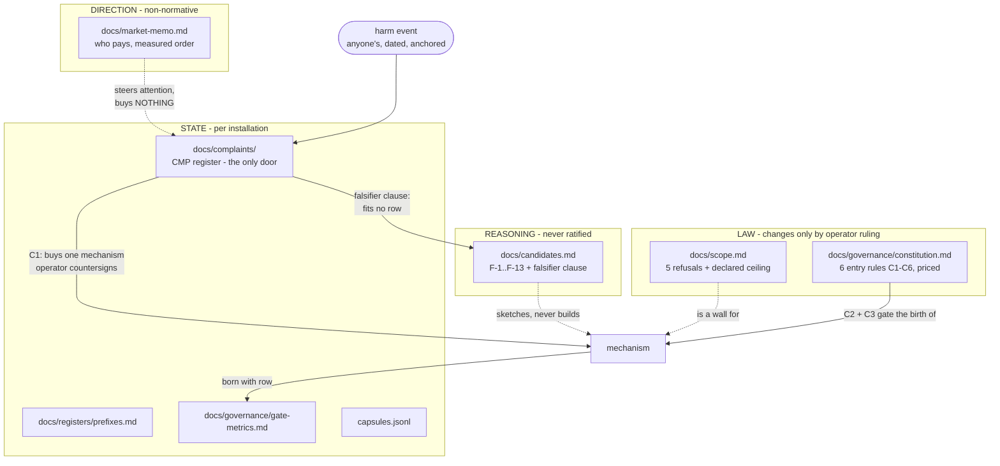
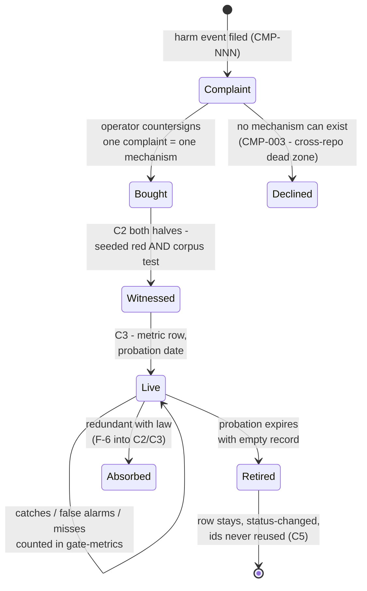
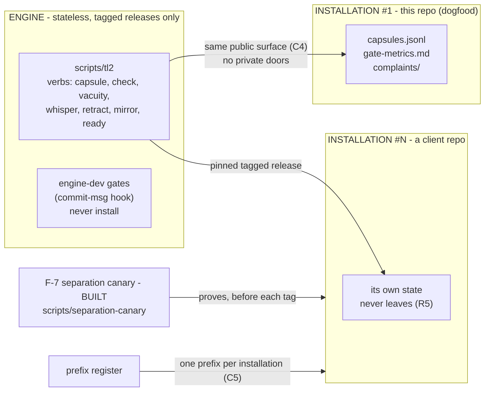
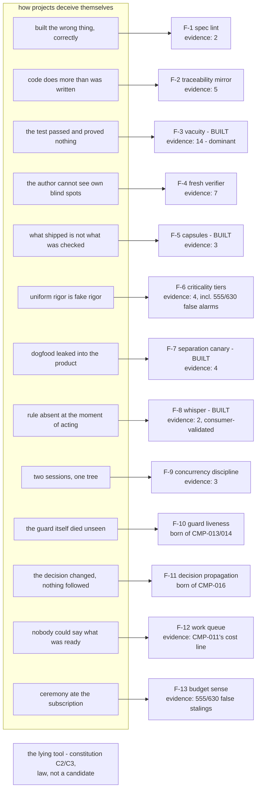

# Diagrams — the system as designed, in five cross-sections

A dated snapshot (2026-09-01). Diagrams rot the way review documents
do (CMP-002), so this file is **guarded by capsules**: before editing
it or any file it depicts, run `./scripts/tl2 whisper docs/diagrams.md`
— the capsules watching this file and its sources will speak. A
SUSPECT on any of them means a picture below may be lying.

## 1. The document layers — what may change what

Four genres, one door. Law changes only by dated operator ruling;
reasoning is deliberately never ratified; direction may be wrong
without anything being broken; state is what recomputation cannot give
back.

## 2. The mechanism lifecycle — how anything gets in, lives, and dies

Every arrow below has happened at least once in this repository's own
history (examples on the edges).

## 3. Engine and installations — where state lives

## 4. Capsule states — a projection, never a stored status

Nothing below is written anywhere; `check` recomputes it from
`capsules.jsonl` plus git at every read (architecture §2).

```mermaid
stateDiagram-v2
    [*] --> Filed: tl2 capsule - sentence + command<br/>+ output sha256 + anchor + watched paths
    Filed --> OK: anchor resolves, watched paths<br/>unchanged, re-run hash matches
    Filed --> SUSPECT: watched path changed since anchor<br/>(committed OR dirty tree)
    Filed --> SUSPECT: anchor unresolvable -<br/>FAIL-CLOSED (history rewrite)
    Filed --> STALE: re-run output hash differs,<br/>or evidence command now fails
    OK --> SUSPECT: next edit of a watched path
    OK --> RETRACTED: tl2 retract - tombstone<br/>with cause + successor (CMP-017)
    SUSPECT --> RETRACTED: the maintenance loop -<br/>retract the outdated, file the successor
    RETRACTED --> [*]: reported by check,<br/>never reddens; whisper falls silent
    note right of SUSPECT
        named dead zones (arch. §2):
        capsule integrity unenforced;
        watched-set adequacy is the
        author's; time and the external
        world are outside every watched set
    end note
```

## 5. The distrust map — DO-178-shaped failure classes, candidates, and their measured evidence

Evidence weights are from the 2026-09-01 harvest of 45 anchored harm
events (v1 + its consumer); BUILT marks a first instance existing.

